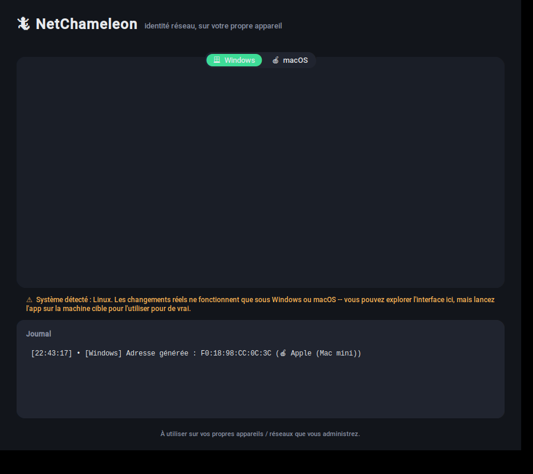

# 🦎 NetChameleon

**A cross-platform desktop app to view and rotate your own network adapter's MAC/IP identity (Windows & macOS).** Full documentation is in French below.




---

## C'est quoi ?

NetChameleon est une appli de bureau (Windows + macOS) qui affiche l'adresse MAC et l'IP de votre carte réseau, et vous permet d'en générer une nouvelle :

- **Mode aléatoire respectueux de la vie privée** (recommandé) — une adresse locale-administrée, dans le même esprit que la fonction native « adresse Wi-Fi privée » d'iOS/Android/Windows. Ne peut jamais entrer en collision avec une vraie adresse constructeur.
- **Mode « style constructeur »** — un vrai préfixe OUI enregistré (Apple, Dell, Lenovo, HP, ASUS, Microsoft, Acer...) suivi d'un suffixe aléatoire, pour une adresse qui a l'apparence d'un appareil de cette marque.

C'est **votre propre machine** que l'appli modifie — pas le trafic d'autres appareils sur le réseau.

## Pourquoi

Beaucoup de réseaux Wi-Fi journalisent les adresses MAC pour suivre les appareils d'une visite à l'autre. Faire tourner son adresse est une protection de vie privée que les OS mobiles offrent déjà nativement ; NetChameleon apporte la même idée, avec plus de contrôle, sur desktop.

## Installation

```bash
git clone https://github.com/REPLACE_ME/netchameleon.git
cd netchameleon
pip install -r requirements.txt
```

**Windows** — lancez un terminal **en tant qu'Administrateur**, puis :
```powershell
python main.py
```
Changer une adresse MAC modifie une propriété avancée du pilote réseau (`NetworkAddress`) puis redémarre l'interface : ça nécessite des droits admin, et tous les pilotes ne l'exposent pas (l'appli vous le dira clairement si le vôtre ne le fait pas).

**macOS** — l'appli a besoin de `sudo` pour changer l'adresse :
```bash
sudo python3 main.py
```
Deux pièges fréquents sur macOS récent :
- Si `pip install` échoue avec `externally-managed-environment`, relancez avec `pip install -r requirements.txt --break-system-packages`
- Si `sudo python3 main.py` dit que `customtkinter` est introuvable (chemin Python différent sous `sudo`), essayez `sudo -E python3 main.py`

⚠️ **Limite honnête :** depuis macOS récent + Apple Silicon, le Wi-Fi intégré a tendance à réimposer l'adresse d'origine à la reconnexion (limitation du firmware, pas de l'appli). Ça fonctionne plus fiablement sur Ethernet (y compris via adaptateur USB-C) et sur les anciens Mac Intel. Pour une simple rotation de confidentialité sur Wi-Fi, le réglage natif **Réglages Système > Wi-Fi > Adresse Wi-Fi privée** reste la voie officiellement supportée par Apple.

## Utilisation

1. Choisissez l'onglet correspondant à votre OS (sélectionné automatiquement)
2. Sélectionnez l'interface réseau concernée
3. Choisissez un mode de génération, cliquez **Générer une adresse** pour prévisualiser
4. Cliquez **Appliquer** pour l'activer réellement
5. **Restaurer l'originale** repositionne l'adresse gravée en usine à tout moment
6. **Renouveler l'IP** redemande une adresse IP en DHCP

## Limites connues

- Windows : nécessite un pilote qui expose la propriété `NetworkAddress` — la plupart des cartes filaires/Wi-Fi modernes le font, certaines cartes bas de gamme non.
- macOS : voir la limite Wi-Fi/Apple Silicon ci-dessus.
- macOS assigne par défaut une adresse Wi-Fi privée et aléatoire à chaque réseau (depuis Monterey). L'app le détecte et l'indique dans la carte "Adresse actuelle" -- ce qui veut dire que le mode "Aléatoire" de NetChameleon fait souvent double emploi avec ce que macOS fait déjà nativement pour le Wi-Fi ; c'est surtout le mode "Style constructeur" qui apporte quelque chose que macOS ne propose pas.
- La base `oui_database.py` est une liste de **démarrage**, pas un miroir complet du registre IEEE — voir la section Contribuer.

## Tests

```bash
pip install -r requirements-dev.txt
pytest -v
```

Les tests simulent le backend système (aucune vraie commande Windows/macOS n'est exécutée), donc ils tournent aussi bien en local que dans la CI GitHub Actions incluse (`.github/workflows/tests.yml`).

## Contribuer

Les contributions sont bienvenues, notamment :
- Étoffer `oui_database.py` avec d'autres constructeurs/préfixes vérifiés (bon premier ticket)
- Tester et corriger le comportement macOS sur différentes puces/versions
- Support Linux (NetworkManager / `ip link`)

## Licence

MIT — voir [LICENSE](LICENSE).

---

*À utiliser sur vos propres appareils et sur des réseaux que vous êtes autorisé·e à administrer.*
